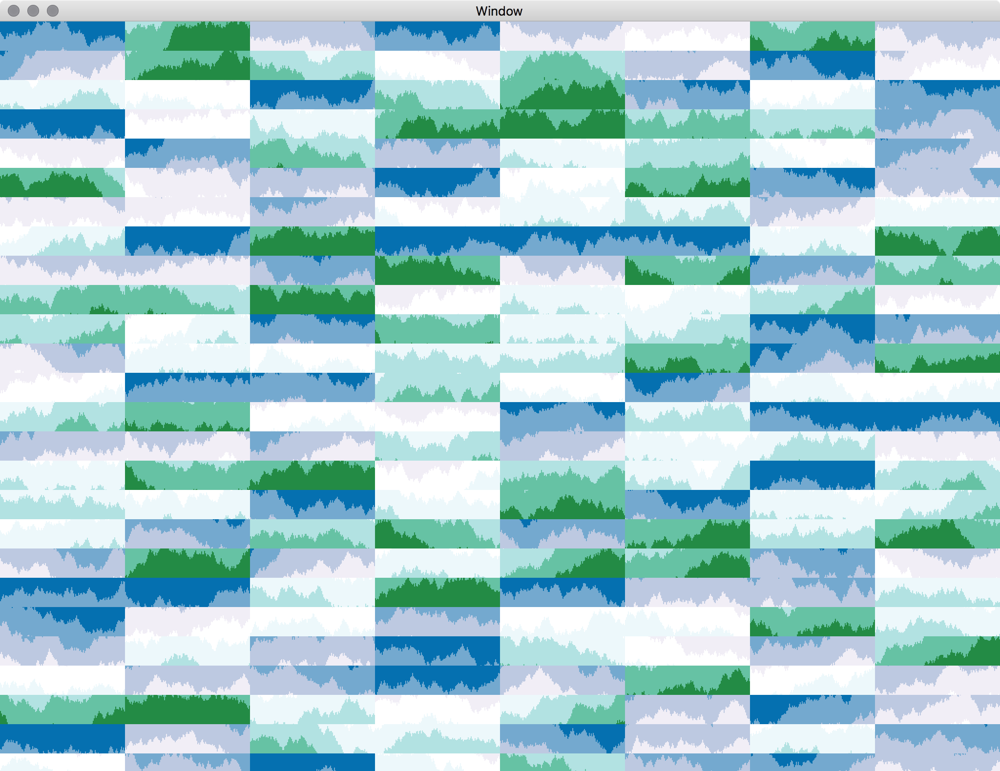

# Metal Metrics

Draw as many horizon charts as you want with the power of a Macintosh (accelerated by [Metal](https://developer.apple.com/metal/)).

## Motive

### Motive 1: High Density, High Granularity

In a modern data centre setting you may have more than a dozen of servers. Even if you have only a handful of servers, you may have many metrics per server. As the number of servers grow, the possible time series to monitor rapidly grows with it, and as we currently stand you are most likely restrained not by the amount of computing energy available, but by the extent of available visual real estate: every metric is to require a certain number of pixels to make sense.

This means as the number of metrics you wish to monitor goes up, you either need to start coalescing time series to save space, or you need to cut down on granularity so as to fit more trend data in the same amount of space.

Horizon charts to the rescue!

A horizon chart is as compact as a sparkline, but conveys roughly the same amount of information easily in 25% of space that takes a line chart to do. This means you can fit 4x as much information in the same space without sacrificing granularity. In practice, sometimes peaks are “coalesced away” meaning that as the granularity gets coarser, interesting information disappears. You end up with nothing significant showing at the level of granularity, yet you continue to have a problem at hand, and need to try deliberately zooming in on every chart in order to find the problem. (NB: a biased sampling function may help, but I am not sure how much of a change it will bring you.) Obviously, granularity is never enough.

### Motive 2: High Frequency, High Performance

The other problem that comes after having a high density visualisation is that you still want the computer running these charts to be cool enough to be useful doing something else. This means the charts need to be very performant.

So I figured that if you can fit an entire 4K monitor with a load of these charts and have them all update at 30–60 FPS, then whatever your use case is, assuming that your tick interval is closer to one new data point per 5 seconds or per 1 minute, any implementation meeting the more stringent performance criterion will be able to meet your needs.

So I set out to make a big window full of charts that are updated in real-time.

## Overview

Simulated data source (one floating number generated per tick), one data source per chart, using colours from [Color Brewer](http://colorbrewer2.org) and in general implementing the Horizon Chart inspired by [Cubism](https://github.com/square/cubism).

A few non-Metal approaches were also tried which clearly explains why, if your computer is connected to mains power, a Metal-driven solution is clearly the most efficient:

* `DrawRectTimeSeriesView` — All chart instances share a single `NSTimer` which ticks six times per second. Chart refreshed in `-[NSView drawRect:]`, entire view redrawn since you are not to manipulate the bitmap context backing up NSView.

* `DisplayLinkTimeSeriesView` — All chart instances share a single `CVDisplayLinkRef` which ticks once per frame. Elegant frame dropping implemented via Grand Central Dispatch, using Dispatch Groups. On each tick, backing image is manipulated (shifted one point to the left) with vImage in Accelerate and a new data point (in reality, a new slice) plotted with CGImage.

* `DoubleLayerTimeSeriesView` — Incomplete implementation where 2 instances of the same CALayer holding reference to the same is shifted by one point on each tick so new values can be drawn in the middle of a fixed-size bitmap without having to push/invalidate all pixels around. Did not work out so well.

Obviously they are all inferior to the Metal approach:

* `MetalTimeSeriesView` — All chart instances sahre a single `CVDisplayLinkRef` which ticks once per frame. Rendition status controlled via GCD and a stupid static boolean variable (i.e. if there is capacity, then refresh all charts on the next tick, and do not refresh anything else until everything has refreshed once. In practice, this allows your charts to run at a lower frame rate if desired without locking up other bits of your interface). All chart instances backed by Metal and share the same Metal Command Queue. Vertex Buffer held as an instance variable and all vertices recomputed on each frame. (In the future they should get shifted.) Colours applied at the same time. (In the future this could be applied in the Metal program instead.)

Also included:

* `RATilingBackgroundView` — A very simple tiling view I have written ages ago (available from GitHub too), which fills a larger NSView with many small views. This is useful when stress-testing the implementation: you can fill an entire screen with many charts, and look for any kind of performance degradation or timing error.

## Pictures

